# miniOrange REST API Authentication Plugin

This page describes how to protect the WordPress REST API using the **JWT Authentication for WP REST APIs** plugin by
miniOrange. The plugin can be used to enable authenticated access to WordPress REST API endpoints using either Basic
Authentication or JWT Authentication.

## Objective

WordPress exposes content and application data through REST API endpoints such as:

```text
/wp-json/wp/v2/posts
```

By default, public endpoints may be accessible without authentication. In this use case, the goal is to configure
miniOrange API Authentication so that REST API calls are protected and clients must authenticate before accessing
secured WordPress REST API resources.

---

## Install the plugin

Start from the WordPress admin dashboard.

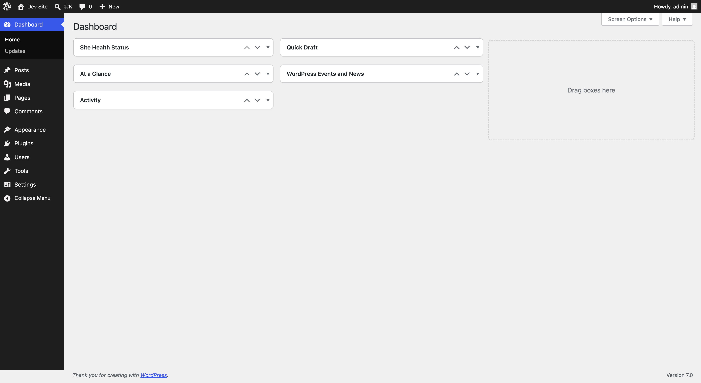

Go to **Plugins → Add Plugin**, then search for:

```text
JWT Authentication for WP REST APIs
```

Install the miniOrange plugin from the search results.

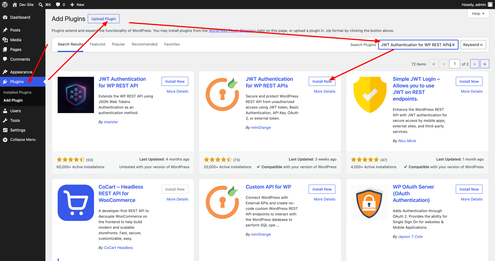

After installation, click **Activate**.

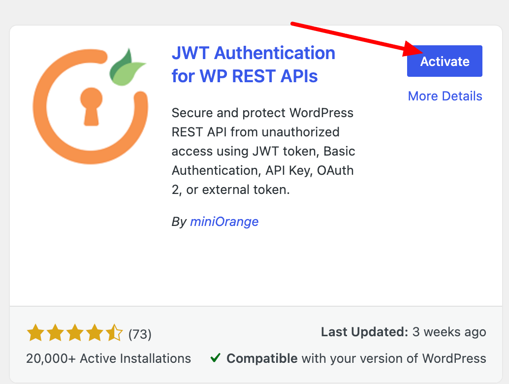

After activation, open the plugin configuration page from the WordPress sidebar using **miniOrange API Authentication**.
You can also open it from the plugin details panel.

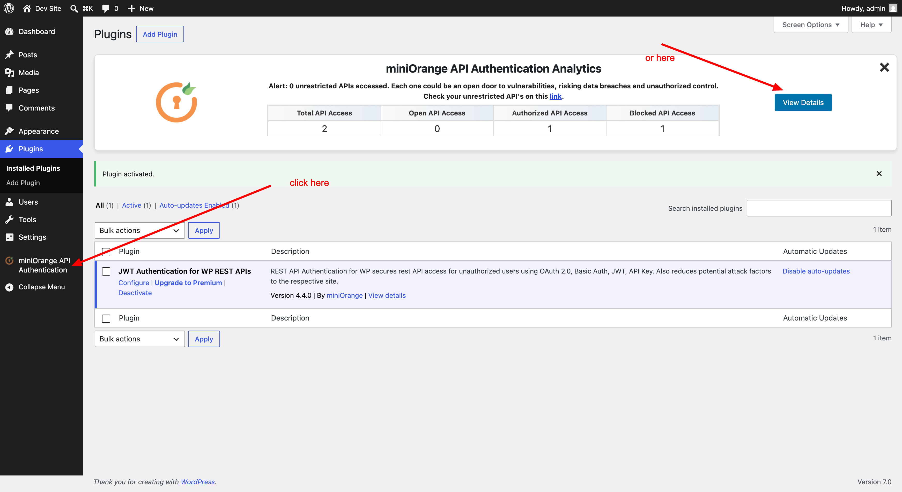

---

## Configure Basic Authentication

On the miniOrange configuration page, select **Basic Authentication**.

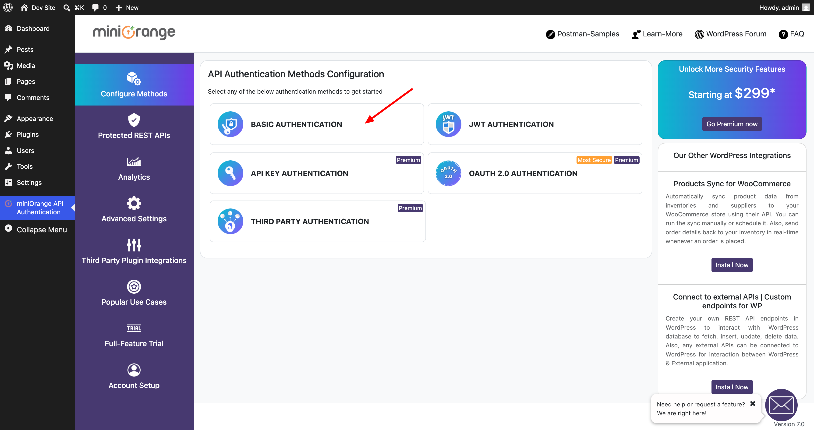

The free configuration uses **Username & Password with Base64 Encoding**. Leave this option selected and click **Next**.

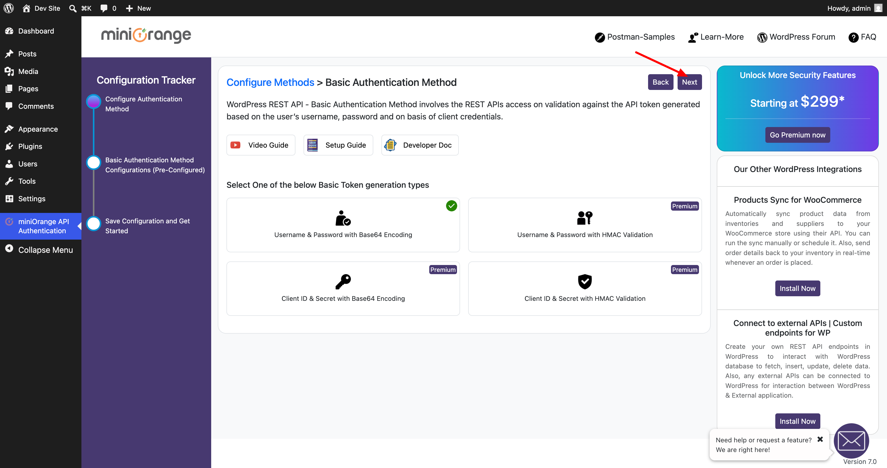

Review the configuration summary. You can test the configuration by entering the WordPress username and password and
calling the REST API endpoint shown on the page.

When the configuration is correct, click **Finish**.

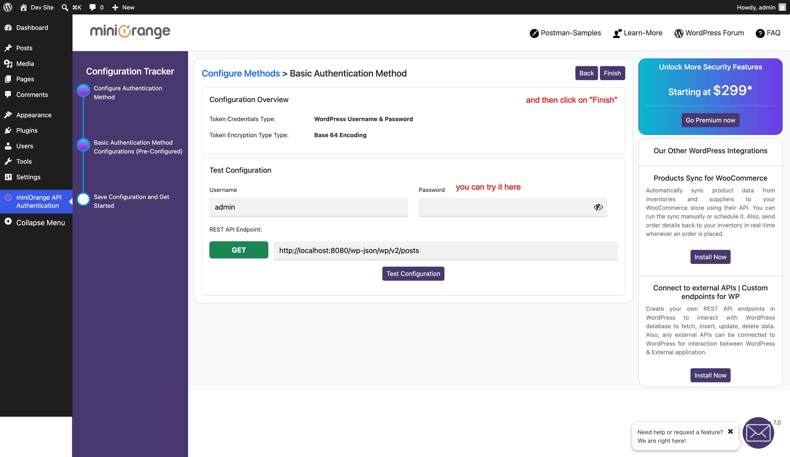

After this configuration, clients can call the WordPress REST API using an `Authorization` header with Basic
credentials.

Example:

```bash
curl -X GET "http://localhost:8080/wp-json/wp/v2/posts" \
  -H "Authorization: Basic <base64(username:password)>"
```

---

## Configure JWT Authentication

To use token-based authentication instead, go back to **Configure Methods** and select **JWT Authentication**.

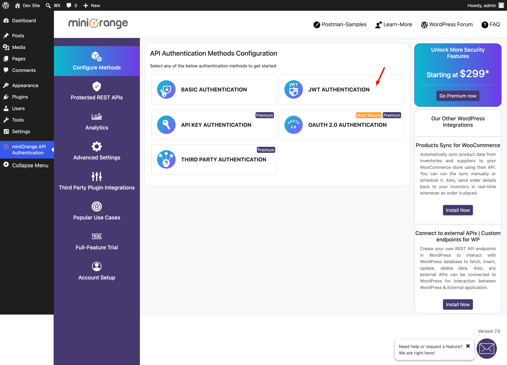

The free configuration uses **Username & Password with Base64 Encoding** and the default **HS256** JWT signing
algorithm. Leave the default option selected and click **Next**.

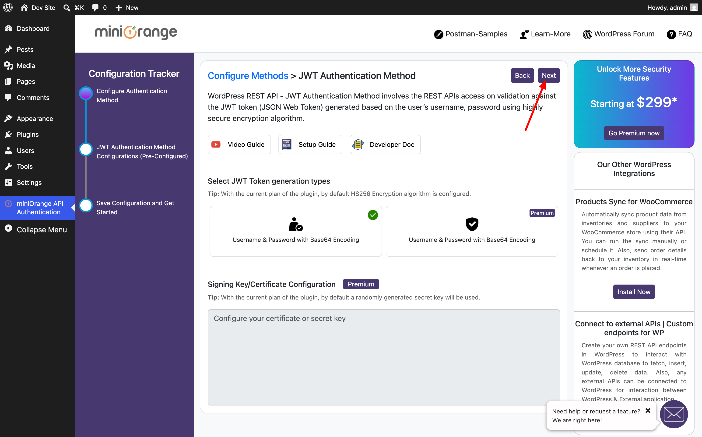

Review the JWT configuration summary.

The plugin exposes a token endpoint similar to:

```text
/wp-json/api/v1/token
```

Enter the WordPress username and password, then click **Fetch Token** to generate a JWT.

You can then validate the token using the validation endpoint:

```text
/wp-json/api/v1/token-validate
```

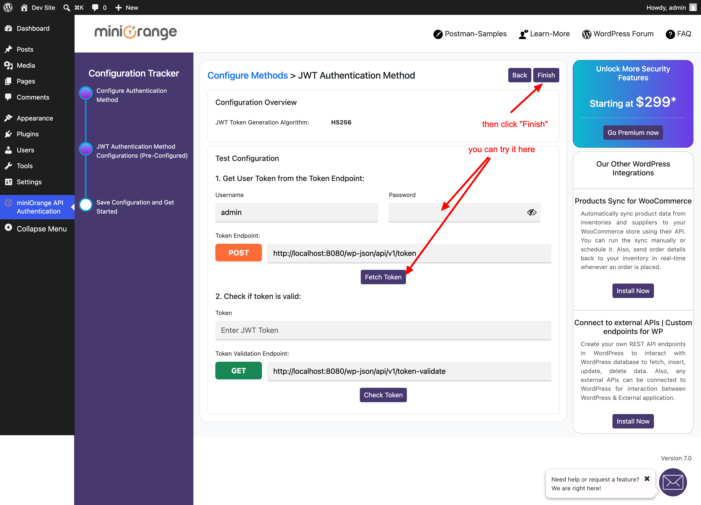

Click **Finish** to save the JWT configuration.

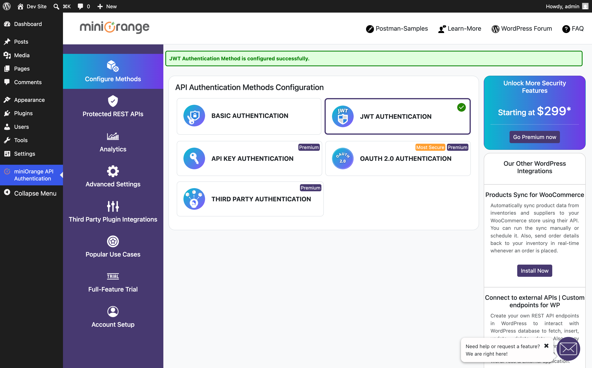

After this configuration, clients first request a token and then use that token when calling protected REST API
endpoints.

Example: fetch a token.

```bash
curl -X POST "http://localhost:8080/wp-json/api/v1/token" \
  -u "admin:<password>"
```

Example: call a protected WordPress REST API endpoint with the JWT.

```bash
curl -X GET "http://localhost:8080/wp-json/wp/v2/posts" \
  -H "Authorization: Bearer <jwt-token>"
```

---

## Result

The WordPress REST API is now protected by miniOrange API Authentication. Depending on the selected method, API clients
can authenticate using either:

- Basic Authentication with a WordPress username and password
- JWT Authentication with a generated bearer token

For integrations and applications, JWT Authentication is usually preferred because clients can exchange credentials for
a token and then use that token for subsequent REST API calls.
